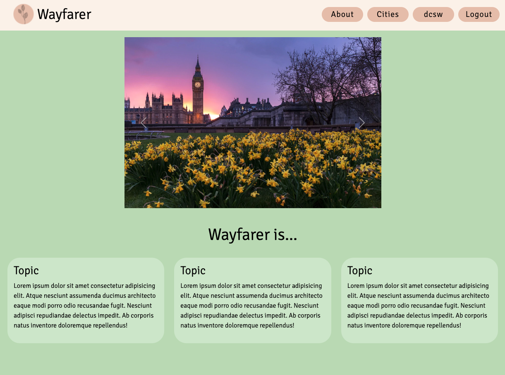
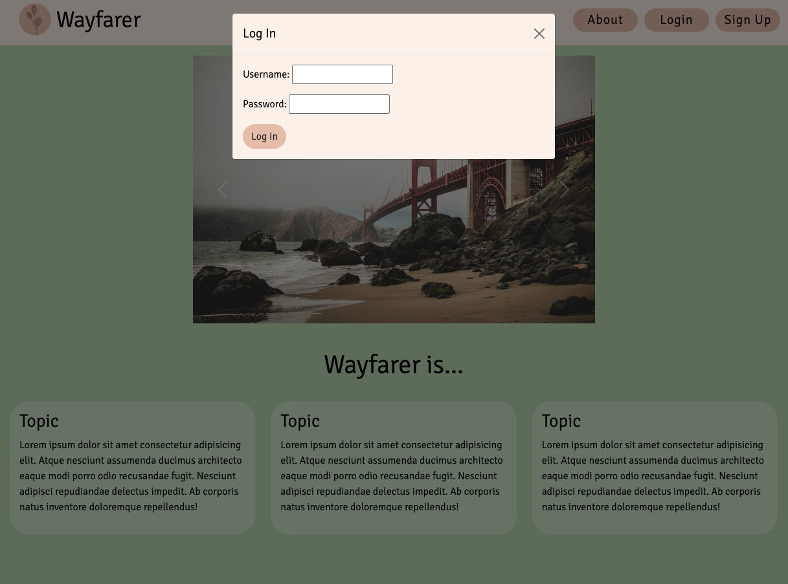
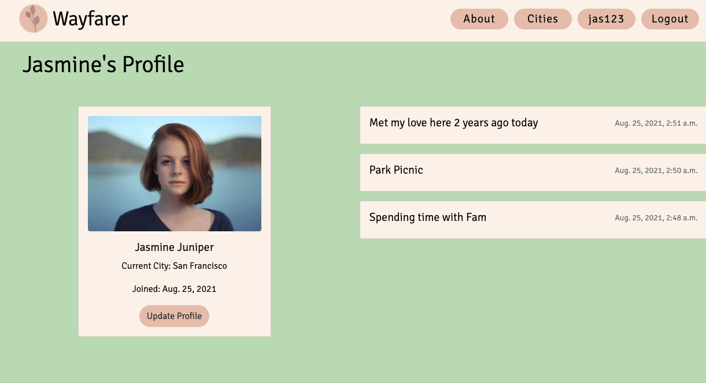
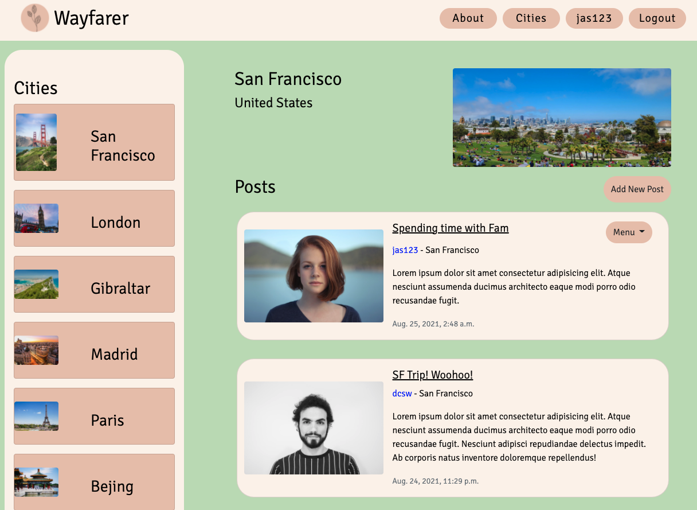
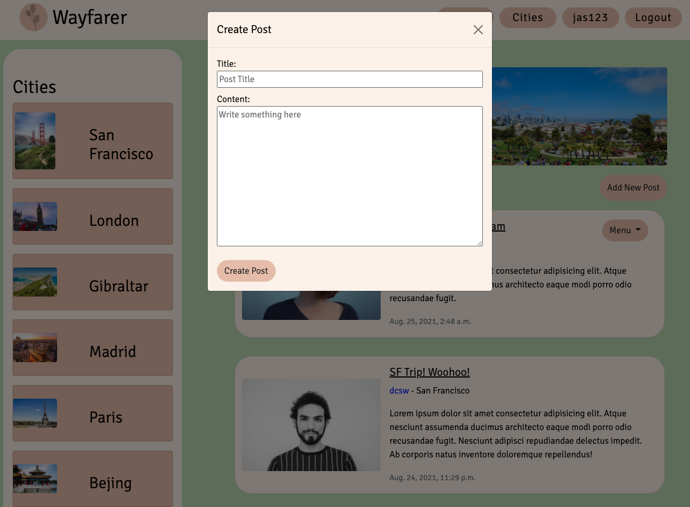
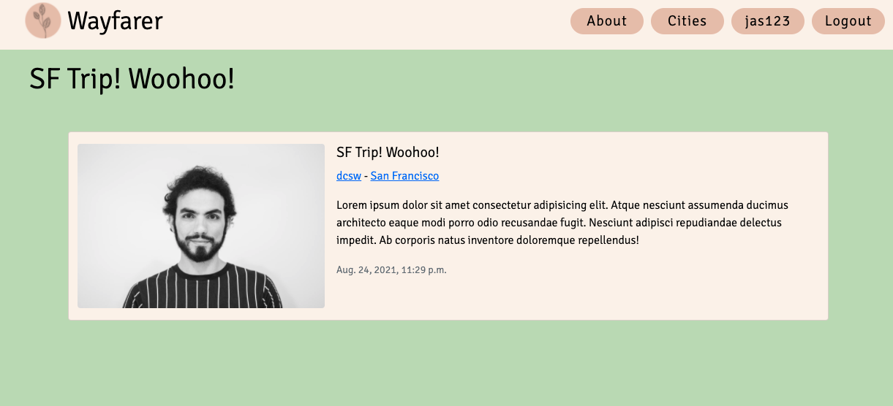
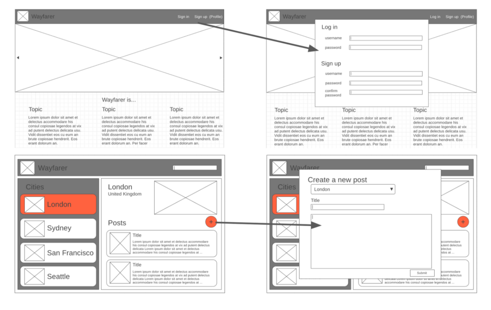
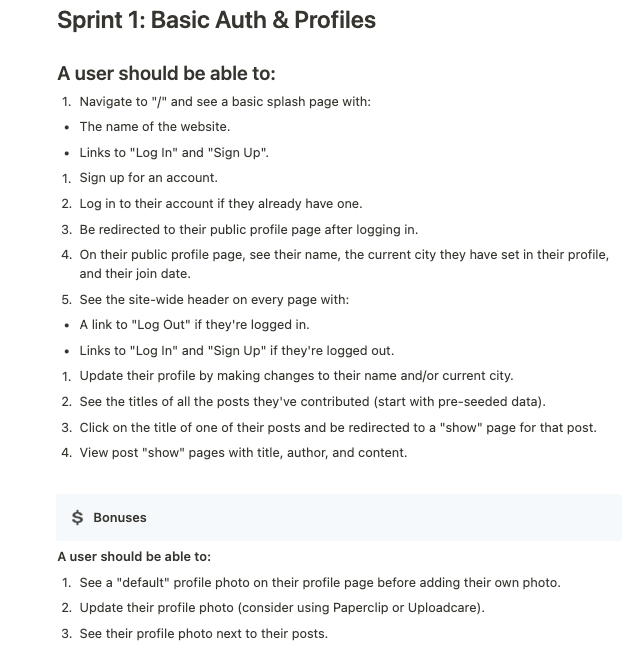
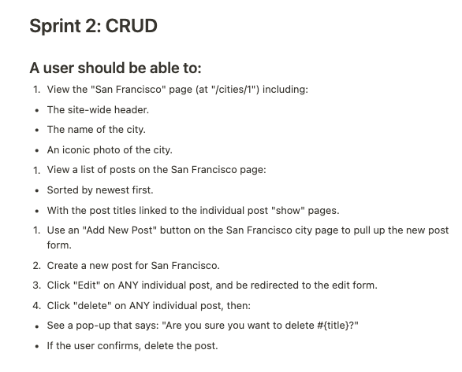
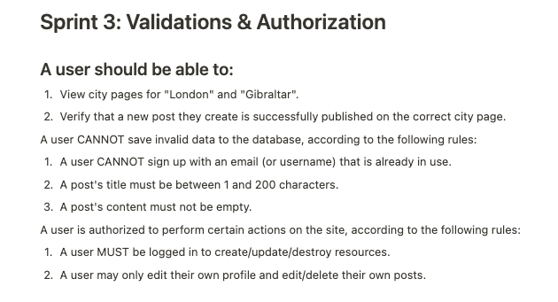

# project-wayfarer
Full-stack django application for project 2 at General Assembly

=== Authors ===

- Jenna Waffensmith | https://github.com/jwaffensmith | https://www.linkedin.com/in/jennawaffensmith/
- Arnav Singh | https://github.com/pandaOnCode | www.linkedin.com/in/arnav-singh-work
- John D. Watt | https://github.com/johndwatt | https://www.linkedin.com/in/john-d-watt/

=== Application link ===

You can access the project wayfarer application at the following link:

https://project--wayfarer.herokuapp.com/

=== Overview ===

Project wayfarer is a client-requested social media site for travelers to share their favorite park locations from around the world. This full-stack django application demonstrates full CRUD functionality, use of RESTful routes, a responsive mobile-first design, and DTL templating to render dynamic web pages. 

=== Technologies Used ===

The following technologies are used in this full-stack application: 
- Python
- Django
- SQL
- Postgresql
- DTL
- Javascript
- CSS
- SASS
- HTML 
- Bootstrap CSS Framework
- Heroku

=== Site Images ===

=== Wireframes ===

=== User Stories / Client Sprints ===

